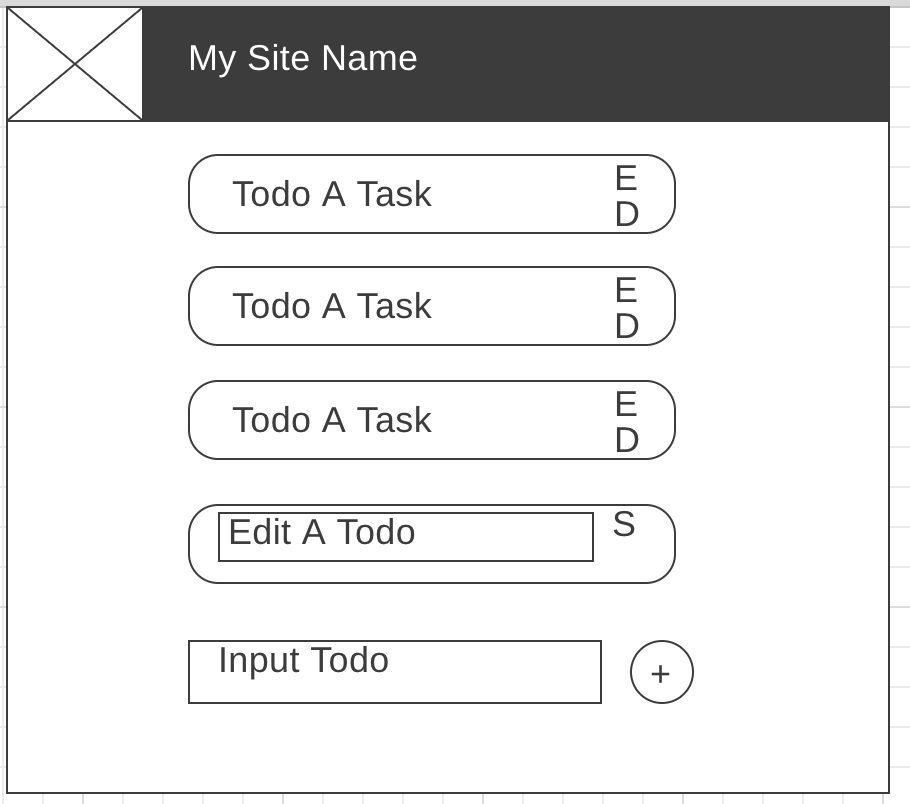

Basic NoDB example

Components
- Header Stateless Component (required)
- List Components (required)
- Todo State Component to keep track if the task is being edited (.5)
- Input State Component for new Todo (.5)

Endpoints
- Get Endpoint to get tasks (required)
- Post Endpoint to create new tasks (required)
- Put Endpoint to update tasks by id (.25)
- Delete Endpoint to delete tasks (.25)

- Full Crud (1)

This will get you to 2.5/3 points. You will need to add just a little more to make it a full project.

Maybe instead of simple todos they have more information that shows in a pop up modal when you click on them.  

Maybe you can mark them complete instead of just deleting them, which will add to a points total.  Turning it into a gamification platform.

Maybe you hit a 3rd party api to populate your initial list.

Maybe you have two lists you can move the tasks between.

Maybe they are cards instead of tasks and you make a recipe viewer.
